# Jarkom_Modul3_Lapres_A03

## Soal 1

Untuk membuat topologi seperti pada soal shift, maka pada topologi.sh kita bisa ganti menjadi seperti dibawah, dengan ada tambahan switch 3, klient madiun dan banyuwangi, serta server tuban.
```
# Switch
uml_switch -unix switch1 > /dev/null < /dev/null &
uml_switch -unix switch2 > /dev/null < /dev/null &
uml_switch -unix switch3 > /dev/null < /dev/null &

# Router
xterm -T SURABAYA -e linux ubd0=SURABAYA,jarkom umid=SURABAYA eth0=tuntap,,,'10.151.72.17' eth1=daemon,,,switch1 eth2=daemon,,,switch3 eth3=daemon,,,switch2 mem=256M &

# Server
xterm -T MALANG -e linux ubd0=MALANG,jarkom umid=MALANG eth0=daemon,,,switch2 mem=160M &
xterm -T MOJOKERTO -e linux ubd0=MOJOKERTO,jarkom umid=MOJOKERTO eth0=daemon,,,switch2 mem=128M &
xterm -T TUBAN -e linux ubd0=TUBAN,jarkom umid=TUBAN eth0=daemon,,,switch2 mem=128M &

# Klien Subnet 1
xterm -T SIDOARJO -e linux ubd0=SIDOARJO,jarkom umid=SIDOARJO eth0=daemon,,,switch1 mem=64M &
xterm -T GRESIK -e linux ubd0=GRESIK,jarkom umid=GRESIK eth0=daemon,,,switch1 mem=64M &

# Klien Subnet 2
xterm -T BANYUWANGI -e linux ubd0=BANYUWANGI,jarkom umid=BANYUWANGI eth0=daemon,,,switch3 mem=64M &
xterm -T MADIUN -e linux ubd0=MADIUN,jarkom umid=MADIUN eth0=daemon,,,switch3 mem=64M &
```

Setelah kita bash topologi.sh, kita ketikan `nano /etc/sysctl.conf` dan uncomment pada `net.ipv4.ip_forward=1`, lalu save dan ketikkan command `sysctl -p` untuk mengaktifkan perubahan yang ada.

Lalu, kita setting IP dari UML dengan `nano /etc/network/interfaces`.

**UML Surabaya:**

```
auto lo
iface lo inet loopback

auto eth0
iface eth0 inet static
address 10.151.72.18
netmask 255.255.255.252
gateway 10.151.72.17

auto eth1
iface eth1 inet static
address 192.168.0.1
netmask 255.255.255.0

auto eth2
iface eth2 inet static
address 192.168.1.1
netmask 255.255.255.0

auto eth3
iface eth3 inet static
address 10.151.73.33
netmask 255.255.255.248
```

**UML Malang:**

```
auto lo
iface lo inet loopback

auto eth0
iface eth0 inet static
address 10.151.73.34
netmask 255.255.255.248
gateway 10.151.73.33
```

**UML Mojokerto:**

```
auto lo
iface lo inet loopback

auto eth0
iface eth0 inet static
address 10.151.73.35
netmask 255.255.255.248
gateway 10.151.73.33
```

**UML Tuban:**

```
auto lo
iface lo inet loopback

auto eth0
iface eth0 inet static
address 10.151.73.36
netmask 255.255.255.248
gateway 10.151.73.33
```

**UML Gresik, Sidoarjo, Banyuwangi, Madiun:**
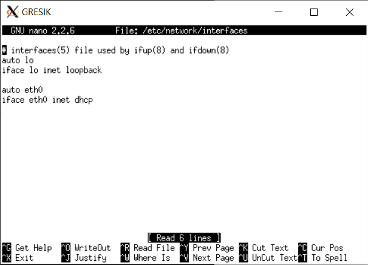

Lalu restart dengan `service networking restart` dan `apt-get update`

## Soal 2

Setting dhcp server dilakukan di Tuban dengan menginstall `apt-get install isc-dhcp-server`. Setelah itu kita edit file settingan nya yaitu `nano /etc/default/isc-dhcp-server`. Pada bagian interface kita isi dengan eth0, sehingga akan sesuai dengan gambar dibawah ini:

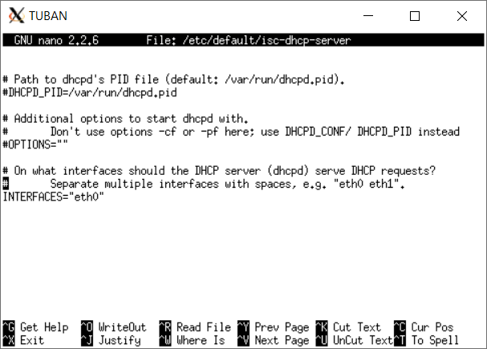

Untuk menjadikan surabaya sebagai DHCP relay, kita bisa melakukan install `apt-get install isc-dhcp-relay`. Pada proses installasi, kita masukkan ip dari dhcp servernya yaitu "Tuban" yaitu `10.151.73.36`, interface nya dikosongi saja untuk di auto configure oleh dhcp relay nya sendiri. Sehingga kalau dilihat settingan isc-dhcp-relay akan menjadi seperti berikut:

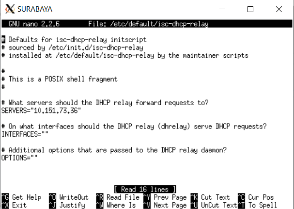

## Soal 3 sampai 6

Buka file konfigurasi DHCP dengan `nano /etc/dhcp/dhcpd.conf` pada Tuban, dan masukkan konfigurasi subnet sesuai dengan gambar dibawah:

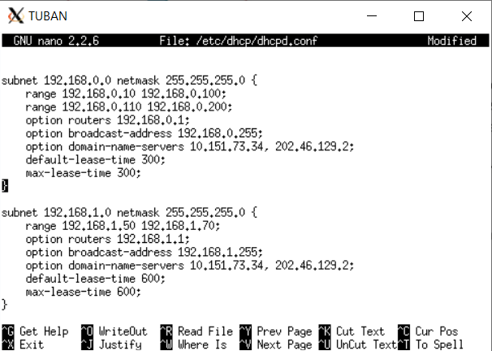
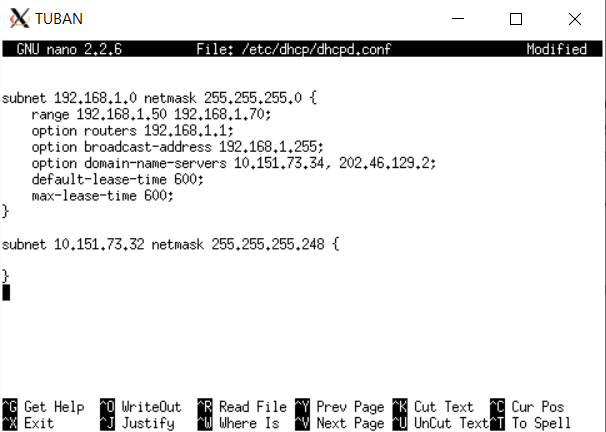

**Soal 3:**

Pada subnet 1 yaitu 192.168.0.0, kita masukkan 
```
range 192.168.0.10 192.168.0.100
range 192.168.0.110 192.168.0.200
```

**Soal 4:**

Pada subnet 3 yaitu 192.168.0.1, kita masukkan 
```
range 192.168.0.50 192.168.0.70
```

**Soal 5:**

Pada kedua subnet, 1 dan 3 yaitu 192.168.0.0 dan 192.168.0.1, kita masukkan 
```
option domain-name-servers 10.151.73.34, 202.46.129.2;
```
agar klien mendapatkan DNS Malang (10.151.73.34) dan DNS 202.46.129.2 dari DHCP

**Soal 6:**

Pada subnet 1 192.168.0.0, kita masukkan 
```
default-lease-time 300;
max-lease-time 300;
```

Sedangkan pada subnet 1 192.168.0.0, kita masukkan 
```
default-lease-time 600;
max-lease-time 600;
```

untuk testingnya, kita bisa lakukan restart dengan `service isc-dhcp-server restart` dan melihat ifconfig dari masing-masing klien:

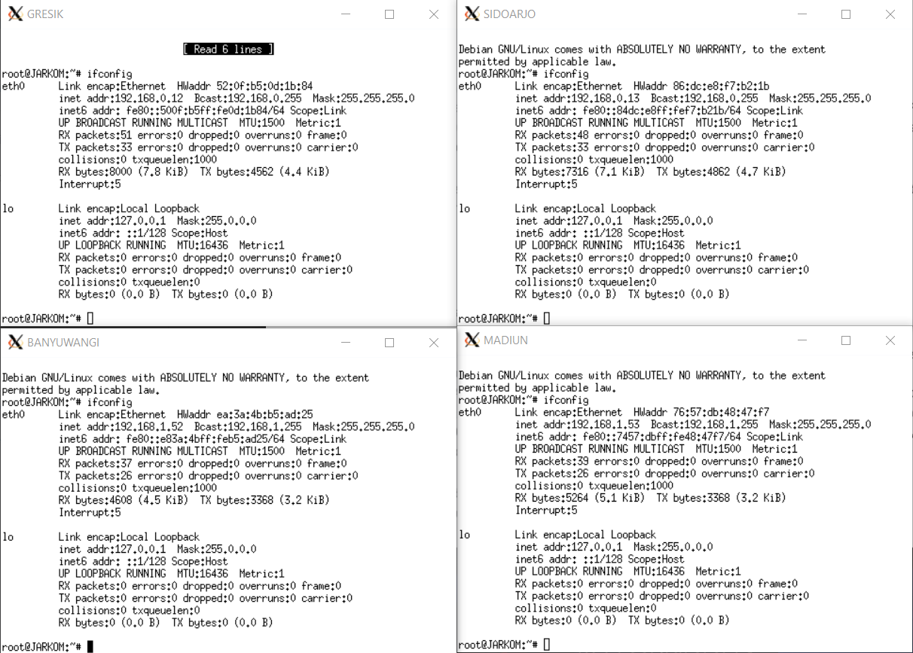

Dan lihat pada resolv.conf nya dengan `cat /etc/resolv.conf`, jika sudah seperti dibawah, berarti konfigurasi dhcp sudah berhasil.

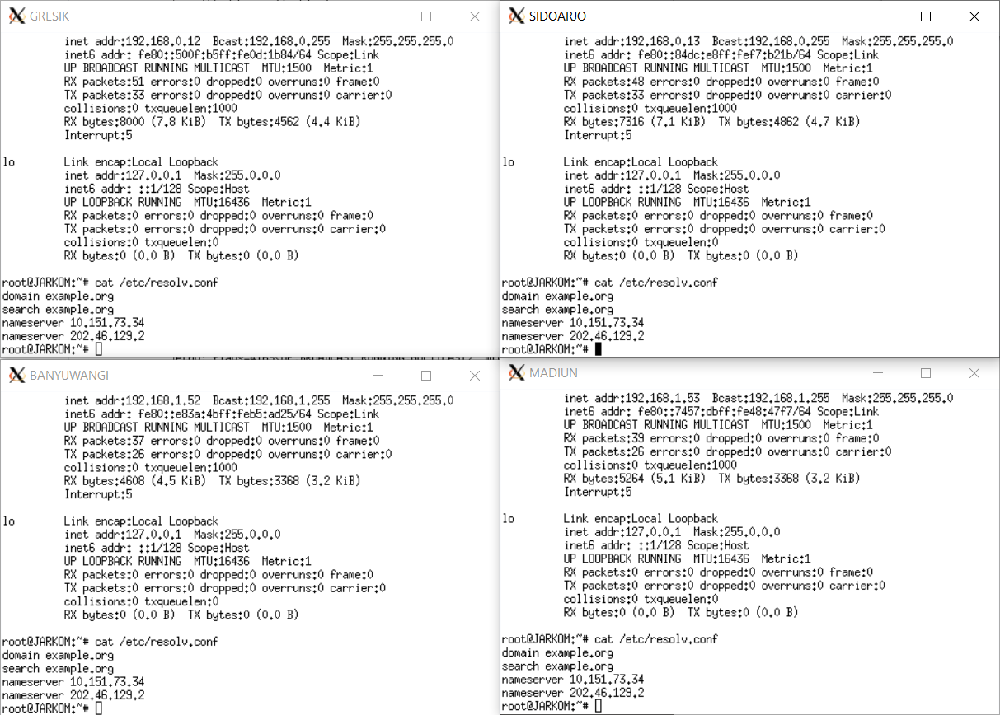

## Soal 7

Pada soal nomor 7, kita diminta untuk membuat User autentikasi dengan format:

User : userta_a03

Password : inipassw0rdta_a03

Pertama, kita buat konfigurasi squid dengan mengetikkan :

```
nano /etc/squid/squid.conf
```

Kedua, kita buat user dan password baru dengan mengetikkan :

```
htpasswd -c /etc/squid/passwd userta_a03
```

Selanjutnya, melakukan type & re type password : inipassw0rdta_a03

Lalu, mengedit konfigurasi squid menjadi:

```
http_port 8080
visible_hostname mojokerto

auth_param basic program /usr/lib/squid3/ncsa_auth /etc/squid3/passwd
auth_param basic children 5
auth_param basic realm Proxy
auth_param basic credentialsttl 2 hours
auth_param basic casesensitive on
acl USERS proxy_auth REQUIRED
http_access deny !USERS
```

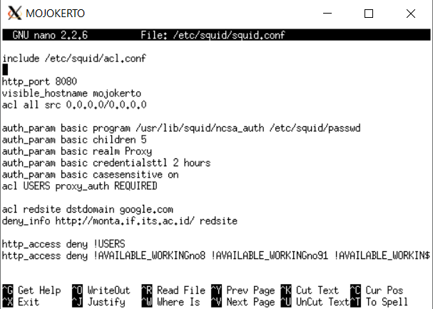
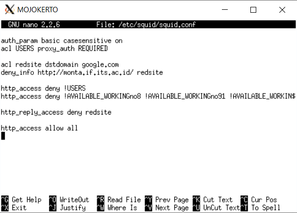

auth_param	: digunakan untuk mengatur autentikasi.

program		: Perintah untuk mendefiniskan autentikator eksternal.

children	: Mendefinisikan jumlah maksimal autentikator muncul.

realm		: Teks yang akan muncul pada pop-up autentikasi.

credentialsttl	: Mengatur masa aktif suatu autentikasi berlaku.

casesensitive	: Mengatur apakah username bersifat case sensitive atau tidak.

acl		: digunakan untuk mendefinisikan pengaturan akses tertentu. 

```
http_access deny !USERS
```

Perintah di atas digunakan untuk melakukan deny pada akses yang dilakukan oleh selain user.

Squid di restart dengan cara mengetikkan perintah:

```
service squid restart
```

Mengubah pengaturan proxy browser dengan menggunakan MOJOKERTO sebagai host dan mengisikan port 8080.

Kemudian saat mengakses web (menggunakan mode incognito/private), akan muncul pop-up untuk login.

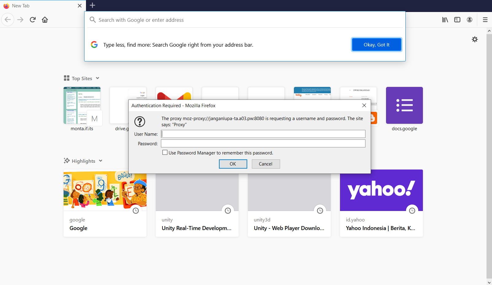

akses akan diberikan saat kita mengisikan username dan password yang benar.

## Soal 8

Diminta membatasi penggunaan internet hanya pada Selasa-Rabu pukul 13.00-18.00

Buat file baru bernama acl.conf di folder squid
nano /etc/squid/acl.conf

Tambahkan baris berikut
acl AVAILABLE_WORKINGno8 time TW 13:00-18:00

MTWHF adalah hari-hari dimana user diperbolehkan menggunakan proxy. (S: Sunday, M: Monday, T: Tuesday, W: Wednesday, H: Thursday, F: Friday, A: Saturday)
Penulisan jam menggunakan format: h1:m1-h2:m2. Dengan syarat h1<h2 dan m1<m2

Tambahkan pada konfigurasi file squid.conf :

include /etc/squid/acl.conf
http_access deny !AVAILABLE_WORKINGno8

include /etc/squid/acl.conf

untuk menambahkan konfigurasi file acl.conf pada file squid.conf

http_access deny !AVAILABLE_WORKINGno8

untuk melakukan deny pada akses yang dilakukan selain pada waktu yang telah disebutkan di AVAILABLE_WORKINGno8


## Soal 9

Diminta melakukan pembatasan setiap hari Selasa-Kamis pukul 21.00 - 09.00 keesokan harinya (sampai Jumat jam 09.00).

Tambahkan baris berikut pada file acl.conf :

acl AVAILABLE_WORKINGno91 time TWH 21:00-23:59
acl AVAILABLE_WORKINGno92 time WHF 00:00-09:00

Format Penulisan jam adalah h1:m1-h2:m2. Dengan syarat h1<h2 dan m1<m2. Sehingga, rentang waktu dijadikan dua, yaitu hari selasa rabu kamis jam 21:00-23:59 dan hari rabu kamis jumat jam 00:00-09:00.

Tambahkan konfigurasi file .conf sehingga menjadi :

http_access deny !AVAILABLE_WORKINGno8 !AVAILABLE_WORKINGno91 !AVAILABLE_WORKINGno92

untuk melakukan deny pada akses yang dilakukan selain pada waktu yang telah disebutkan di AVAILABLE_WORKINGno8, AVAILABLE_WORKINGno91, dan AVAILABLE_WORKINGno92

## Soal 10

Diminta melakukan redirect saat mengakses google.com menjadi menuju monta.if.its.ac.id 

Tambahkan pada konfigurasi file squid.conf :

acl redsite dstdomain google.com
deny_info http://monta.if.its.ac.id redsite

http_reply_access deny redsite

acl redsite dstdomain google.com
untuk mendefinisikan site yang mau diredirect

deny_info http://monta.if.its.ac.id redsite
untuk melakukan memberikan deny info pada redsite dengan http://monta.if.its.ac.id

http_reply_access deny redsite
untuk melakukan deny pada reply access redsite

7-10 file squid.conf

include /etc/squid/acl.conf

http_port 8080
visible_hostname mojokerto

auth_param basic program /usr/lib/squid3/ncsa_auth /etc/squid3/passwd
auth_param basic children 5
auth_param basic realm Proxy
auth_param basic credentialsttl 2 hours
auth_param basic casesensitive on
acl USERS proxy_auth REQUIRED
http_access deny !USERS
http_access deny !AVAILABLE_WORKINGno8 !AVAILABLE_WORKINGno91 !AVAILABLE_WORKINGno92
acl redsite dstdomain google.com
deny_info http://monta.if.its.ac.id/ redsite 
http_reply_access deny redsite 
http_access allow all

http_access allow all
untuk melakukan allow pada semua akses selain pengecualian yang sudah disebutkan.


## Soal 11

Diminta mengubah error page default squid 

Melakukan wget sesuai perintah soal.
Melakukan back up pada error page default squid

error page default squid :
/usr/share/squid/errors/en/ERR_ACCESS_DENIED

Melakukan back up pada file ERR_ACCESS_DENIED , kemudian melakukan rename menjadi ERR_ACCESS_DENIEDbak :

mv /usr/share/squid/errors/en/ERR_ACCESS_DENIED /usr/share/squid/errors/en/ERR_ACCESS_DENIEDbak

Mengganti error page default squid : 
mv ERR_ACCESS_DENIED /usr/share/squid/errors/en/ERR_ACCESS_DENIED

## Soal 12

Pada malang, kita akan buat domain dengan nama "janganlupa-ta.a03.pw". Caranya adalah sebagai berikut:

Lakukan command `nano /etc/bind/named.conf.local` untuk mengedit file itu, lalu isikan zone nya seperti gambar dibawah ini:

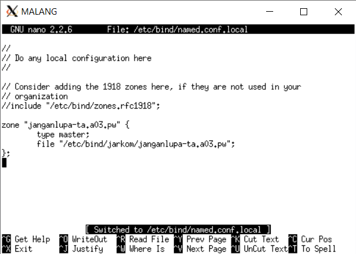

setelah itu kita buat folder jarkom dengan command `mkdir /etc/bind/jarkom`, dan copy file db.local kedalam folder itu dengan `cp /etc/bind/db.local /etc/bind/jarkom/janganlupa-ta.a03.pw`. Kemudian isi dari file tersebut kita sesuai dengan dengan gambar dibawah ini, dengan ip dari domain tersebut diarahkan kepada mojokerto (10.151.73.35) sebagai proxy server:

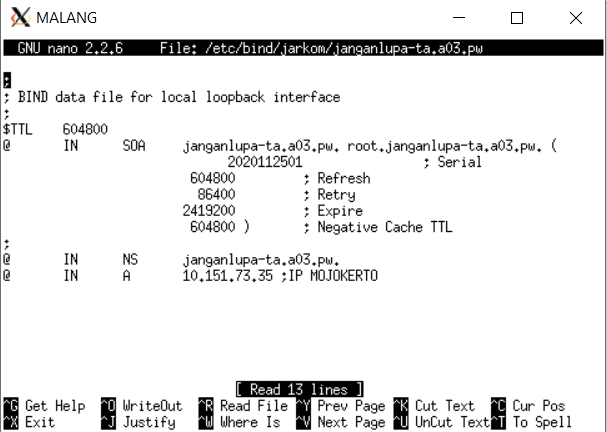

pada settingan proxy, bisa dirubah dengan domain yang sudah didefinisikan diatas tadi, dan juga masih bisa dibuka sesuai dengan konfigurasi yang ada di proxy.

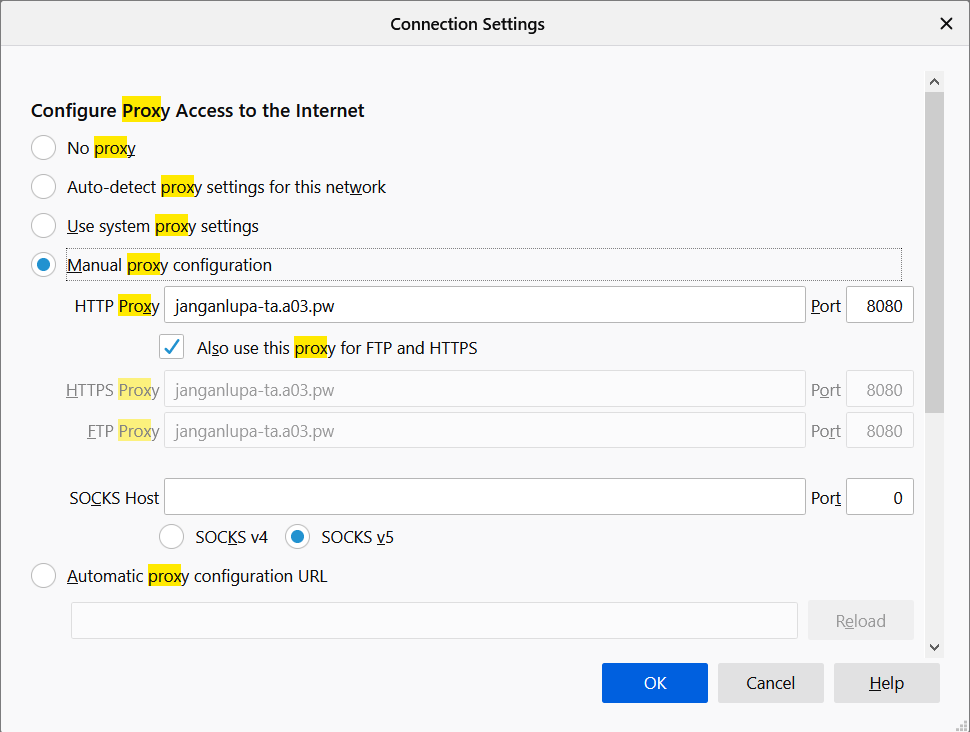

